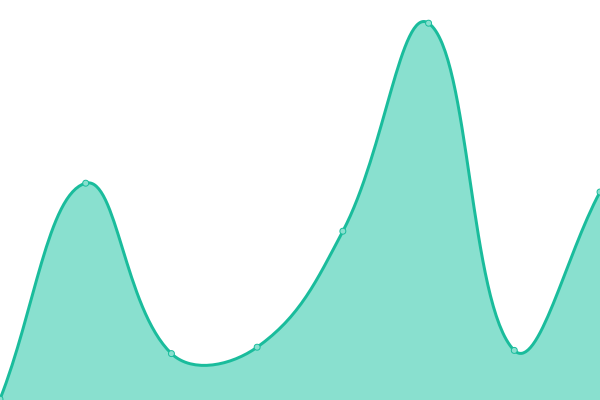

# [📈 Live Status](https://up.hinzwifi.xyz): <!--live status--> **🟧 Partial outage**

This repository contains the open-source uptime monitor and status page for [hinzwifi](https://up.hinzwifi.xyz), powered by [Upptime](https://github.com/upptime/upptime).

With [Upptime](https://upptime.js.org), you can get your own unlimited and free uptime monitor and status page, powered entirely by a GitHub repository. We use [Issues](https://github.com/hinzwifi/upptime/issues) as incident reports, [Actions](https://github.com/hinzwifi/upptime/actions) as uptime monitors, and [Pages](https://up.hinzwifi.xyz) for the status page.

<!--start: status pages-->
<!-- This summary is generated by Upptime (https://github.com/upptime/upptime) -->
<!-- Do not edit this manually, your changes will be overwritten -->
<!-- prettier-ignore -->
| URL | Status | History | Response Time | Uptime |
| --- | ------ | ------- | ------------- | ------ |
|  [Main Page](https://hinzwifi.xyz) | 🟥 Down | [main-page.yml](https://github.com/hinzwifi/uptime-hinz/commits/HEAD/history/main-page.yml) | 

 323ms
     
 | 

<a href="https://up.hinzwifi.xyz/history/main-page">87.07%</a>
    

|  [μlogger](https://gps.hinzwifi.xyz/) | 🟩 Up | [mlogger.yml](https://github.com/hinzwifi/uptime-hinz/commits/HEAD/history/mlogger.yml) | 

 341ms
     
 | 

<a href="https://up.hinzwifi.xyz/history/mlogger">88.76%</a>
    

|  [Pastebin](https://paste.hinzwifi.xyz/) | 🟥 Down | [pastebin.yml](https://github.com/hinzwifi/uptime-hinz/commits/HEAD/history/pastebin.yml) | 

 345ms
     
 | 

<a href="https://up.hinzwifi.xyz/history/pastebin">86.38%</a>
    

|  [Plainpad](https://notes.hinzwifi.xyz/public/) | 🟩 Up | [plainpad.yml](https://github.com/hinzwifi/uptime-hinz/commits/HEAD/history/plainpad.yml) | 

 239ms
     
 | 

<a href="https://up.hinzwifi.xyz/history/plainpad">10.13%</a>
    

|  [File Share](https://share.hinzwifi.xyz/) | 🟩 Up | [file-share.yml](https://github.com/hinzwifi/uptime-hinz/commits/HEAD/history/file-share.yml) | 

 225ms
     
 | 

<a href="https://up.hinzwifi.xyz/history/file-share">87.83%</a>
    

|  [KeeWeb](https://hinzwifi.xyz/passwords/) | 🟥 Down | [kee-web.yml](https://github.com/hinzwifi/uptime-hinz/commits/HEAD/history/kee-web.yml) | 

 117ms
     
 | 

<a href="https://up.hinzwifi.xyz/history/kee-web">11.51%</a>
    

|  [MyIIT](http://x4150my.msuiit.edu.ph/my/getmyiit.php) | 🟩 Up | [my-iit.yml](https://github.com/hinzwifi/uptime-hinz/commits/HEAD/history/my-iit.yml) | 

 1336ms
     
 | 

<a href="https://up.hinzwifi.xyz/history/my-iit">100.00%</a>
    

|  [Birthdays](https://m.hinzwifi.xyz) | 🟩 Up | [birthdays.yml](https://github.com/hinzwifi/uptime-hinz/commits/HEAD/history/birthdays.yml) | 

 214ms
     
 | 

<a href="https://up.hinzwifi.xyz/history/birthdays">85.61%</a>
    

|  [MuskAPI](https://muskapi.hinzwifi.xyz/) | 🟩 Up | [musk-api.yml](https://github.com/hinzwifi/uptime-hinz/commits/HEAD/history/musk-api.yml) | 

 160ms
     
 | 

<a href="https://up.hinzwifi.xyz/history/musk-api">88.26%</a>
    

<!--end: status pages-->

[**Visit our status website →**](https://up.hinzwifi.xyz)

## 📄 License

- Powered by: [Upptime](https://github.com/upptime/upptime)
- Code: [MIT](./LICENSE) © [hinzwifi](https://up.hinzwifi.xyz)
- Data in the `./history` directory: [Open Database License](https://opendatacommons.org/licenses/odbl/1-0/)
